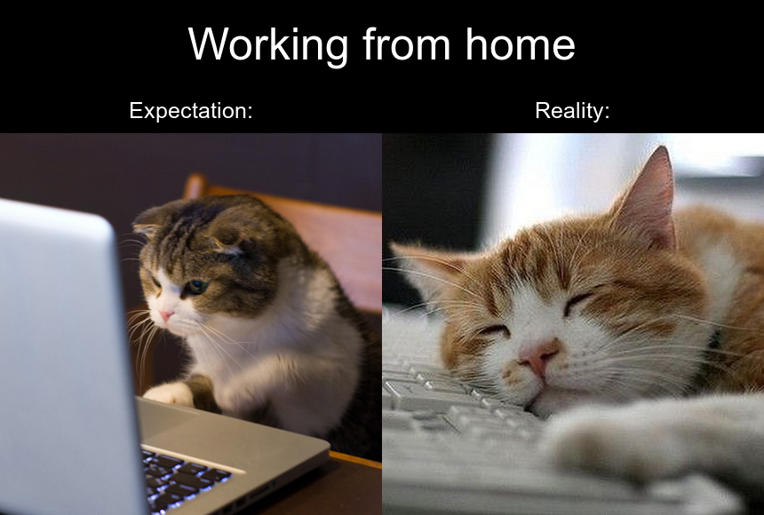

```{r setup, include=FALSE}
knitr::opts_chunk$set(message = FALSE, echo = TRUE)
```
<br>

<h2> <a href="report.html"> Report </a> </h2>

<br>

## My meme

As many of us are now working in a remote environment, I loved how much I can relate to the original meme I found!




```{r file='meme.R', eval=FALSE, class.source="codeblocks"}
```

<br>
<br>
<br>
<br>

## My animated GIF

While I was searching for some inspiration online, found a really cute GIF so decided to alter it slightly for my assignment!


<p> (Please refresh the page if my gif doesn't move) </p>

```{r file='animation.R', eval=FALSE, class.source="codeblocks"}

```

<br>
<br>
<br>
<br>

## **Custom CSS**
<p> By the way, have you noticed my custom icon for this page? </p>
```{css, echo=TRUE, class.source="codeblocks"}
/* Welcome to my custom CSS section for this page! */

@import url('https://fonts.googleapis.com/css2?family=Permanent+Marker&display=swap');
@import url('https://fonts.googleapis.com/css2?family=Gochi+Hand&display=swap');

h1, h2{
  font-family: 'Permanent Marker', cursive;
}

h3, h4, p{
  font-family: 'Gochi Hand', cursive;
}

h1{
  font-weight: bold;
}

p{
  font-size: 20px;
}

img{
  display: block;
  margin-left: auto;
  margin-right: auto;
  width: 50%;
}

.codeblocks {
  background-color: black;
  color: white;
  text-align: left;
}

.hljs-comment{
font-style: normal !important;
}

.caption {
  font-weight: bold;
  font-size: 25px !important;
}

body{ 
  background-image: url("https://www.toptal.com/designers/subtlepatterns/uploads/dark_wood.png"); 
  text-align: center;
  color: #FFFFFF;
}
```


