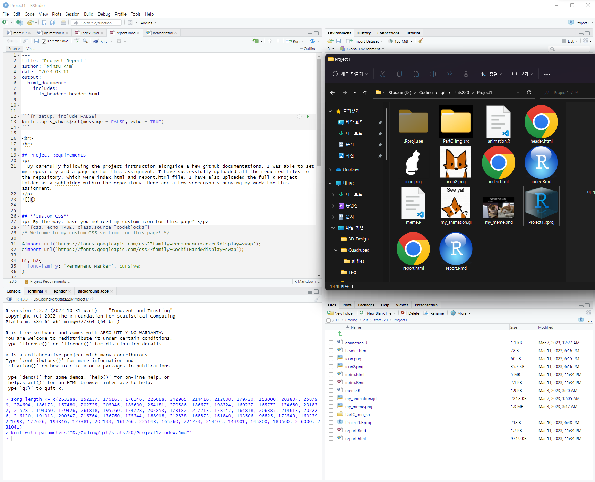
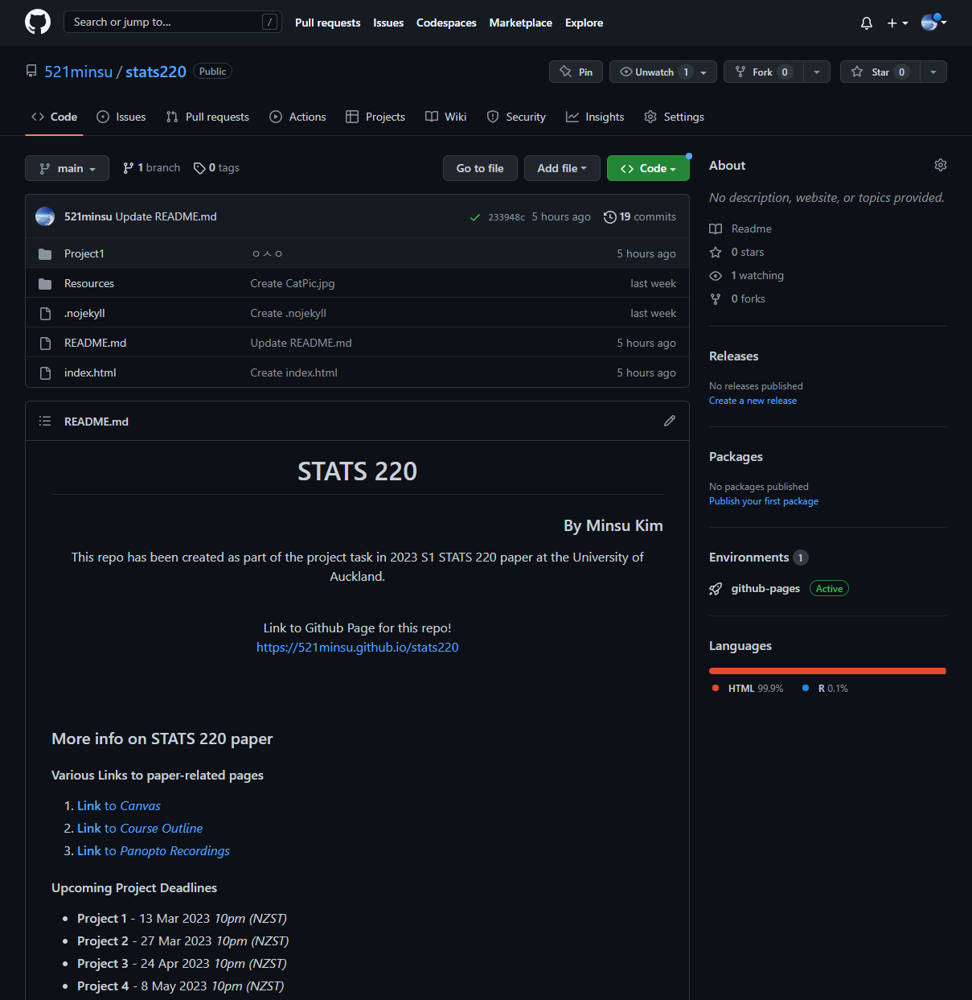
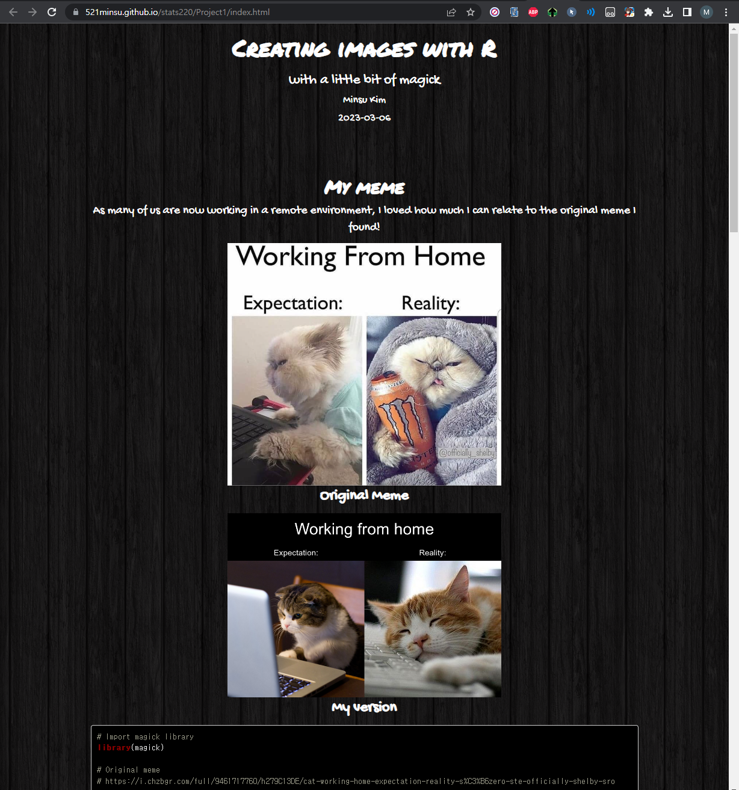

```{r setup, include=FALSE}
knitr::opts_chunk$set(message = FALSE, echo = TRUE)
```

<br>
<br>

## Project Requirements
<p>
  By carefully following the project instruction alongside a few github documentations, I was able to set my repository and a page up for this assignment. I have successfully uploaded all the required files to the repository, which were index.html and report.html file. I have also uploaded the full R Project folder as a subfolder within the repository. I have attached required photo evidence at the bottom of this page.They are so long to be in the middle! 
</p>

## Creativity
<p> Additional {magick} functions that were not covered in lectures/labs </p>

```{css, class.source="codeblocks"}
image_crop(geometry_area(430, 430, 200), repage=FALSE) 
/* To crop an image so that it fits the required/preferred size for my meme and gif. */

image_resize(reality_photo_original, geometry_size_pixels(height=430, preserve_aspect = TRUE)) 
/*resized parts of my meme to their preferred size. */

paste0("PartC_img_src/", i, ".png") 
/*Not part of the {magick} functions, but allows stitching variables and strings together, allowing myself to use a 
for-loop to efficiently process 10 frames for my gif. */

```
<br>

<p> Using more CSS than what was required </p>

```{css, echo=TRUE, class.source="codeblocks"}
/* Welcome to my custom CSS section for this page! */

@import url('https://fonts.googleapis.com/css2?family=Permanent+Marker&display=swap');
@import url('https://fonts.googleapis.com/css2?family=Gochi+Hand&display=swap');

h1, h2{
  font-family: 'Permanent Marker', cursive;
}

h3, h4, p{
  font-family: 'Gochi Hand', cursive;
}

h1{
  font-weight: bold;
}

p{
  font-size: 20px;
}

img{
  display: block;
  margin-left: auto;
  margin-right: auto;
  width: 50%;
}

.codeblocks {
  background-color: black;
  color: white;
  text-align: left;
}

.hljs-comment{
font-style: normal !important;
}

.caption {
  font-weight: bold;
  font-size: 25px !important;
}

body{ 
  background-image: url("https://www.toptal.com/designers/subtlepatterns/uploads/dark_wood.png"); 
  text-align: center;
  color: #FFFFFF;
}
```

<br>

<p> Adding Webpage icon to pages </p>
```{css, class.source="codeblocks"}
/* This took a few extra steps to be embedded into a Rmd file. 

1. I have created an extra file named "header.html" with a single tag "<link rel="icon" href="icon2.png" />" in it.

2. On the yaml part of each page, I have modified the output line to be like this:

output: 
  html_document:
    includes:
      in_header: header.html

Now my page has a cute corgi icon!

*/
```
<br>
<br>

## Learning Reflection
<p>
  While I was working on this assignment, I was able to learn that modern technologies are much more simpler and easier to approach than some people might have thought of. As an example, knitting html from a markdown page in combination with a bit of css was more than enough to create a somewhat nice-looking webpage, that could be used for various purposes. As technology develops, they don't just become nicer to utilise as a customer, but they become much more approachable and understandable for developers as well.
  <br>
  Nowadays, we can even game on our internet browsers. However, that's only when many different scripts, languages and other technologies work together to make it work. I'm now curious on how far this css can take us in terms of making an appealing website without javascript and other front-end technologies.
</p>

<br>
<br>

## Photo evidence
<br>

<br>

<br>

